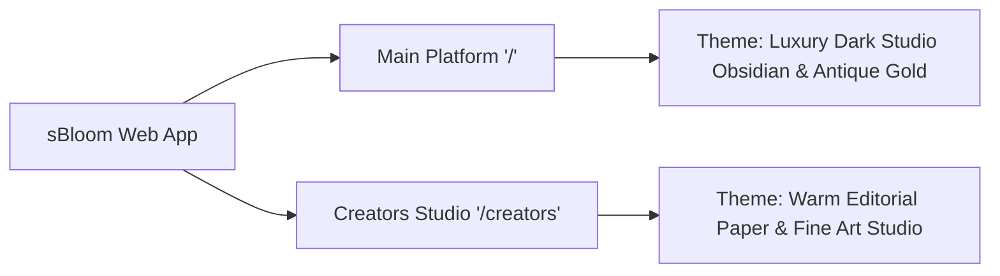

# sBloom — Master Context Handover & Codebase Architecture Document

> **Document Version:** 2.0.0  
> **Last Updated:** September 17, 2026  
> **Project Name:** S-Bloom — Bloom Your Digital Presence (An Ottobon Professional Services Venture)  
> **Repository Root:** `d:\Ottobon\sBloom new\S-Bloom`  
> **Active Port:** `5173` (Vite with Host & Ngrok Support)  
> **Author & Maintainer:** Ottobon Engineering & sBloom Creative Team  

---

## Table of Contents
1. [Project Overview & Core Business Objectives](#1-project-overview--core-business-objectives)
2. [Mandatory Maintenance & Update Protocol (Crucial)](#2-mandatory-maintenance--update-protocol-crucial)
3. [Technology Stack & Dependency Matrix](#3-technology-stack--dependency-matrix)
4. [Complete Codebase Architecture & File Inventory](#4-complete-codebase-architecture--file-inventory)
5. [Dual-Experience Visual Design System](#5-dual-experience-visual-design-system)
6. [Detailed End-to-End User Flows & State Machines](#6-detailed-end-to-end-user-flows--state-machines)
7. [Component Deep-Dive & Data Contract Specifications](#7-component-deep-dive--data-contract-specifications)
8. [Asset Directory & Media Inventory](#8-asset-directory--media-inventory)
9. [Local Development, Tunnels & Deployment Guide](#9-local-development-tunnels--deployment-guide)
10. [Known Quirks, Edge Cases & Technical Roadmap](#10-known-quirks-edge-cases--technical-roadmap)
11. [Historical Change Log](#11-historical-change-log)

---

## 1. Project Overview & Core Business Objectives

### 1.1 Venture Background
**sBloom** is a high-growth creative infrastructure and personal branding venture incubated under **Ottobon Professional Services**. It solves the central bottleneck facing modern creators, independent professionals, and institutions: **creative burnout and technical complexity in digital presence building.**

The platform offers a full-funnel operating model summarized by its core ethos:
> *"You Create. We Handle the Rest."*  
> *"Stop burning out trying to be a videographer, audio engineer, editor, and algorithm analyst all at once."*

### 1.2 The Three Audience Segments (The Gateways)
The codebase is architected around three specific high-value customer funnels:

1. **Creators & Artists (Individual Talent):**
   - *Target:* Actors, dancers, singers, visual artists, digital influencers, and creative entrepreneurs.
   - *Offering:* 5-Pillar Creator Accelerator, 3-second viral hook architecture, soundstage studio recording with pro cameras, 48kHz audio capture, friendly teleprompter direction, and high-retention video post-production.
   - *Dedicated Route:* `/creators` (or `#/creators`).

2. **Business Professionals (Independent Practices):**
   - *Target:* Healthcare specialists (surgeons, doctors, clinic owners), legal advisors, chartered accountants, and independent executive coaches.
   - *Offering:* The "2-Hour Monthly Batching Shoot" (120 minutes of recording yields 24–30 published assets/month), ethical thought leadership, and Google Business Profile (GBP) regional dominance to drive inbound consultations.
   - *Funnel Mechanism:* Interactive Gateway Modal on the main page.

3. **Institutions & Campuses (Enterprise & Groups):**
   - *Target:* Hospitals, healthcare systems, colleges, private schools, and training institutes.
   - *Offering:* Multi-staff/faculty brand uniformity, regional reputation architecture, multi-campus local SEO, and student/patient intake portals.
   - *Funnel Mechanism:* Interactive Gateway Modal with outbound connections to specialized portals (`marketing.ottobon.in` and `marketing.medctech.com`).

---

## 2. Mandatory Maintenance & Update Protocol (Crucial)

> [!IMPORTANT]
> **RULE OF CODEBASE CONTINUITY:**  
> Any engineer, contributor, or AI agent making code, style, component, or asset changes to this repository **MUST** update this `CONTEXT_HANDOVER.md` document during the same working session.
> Failure to update this document leads to context fragmentation and technical debt.

### 2.1 The Update Checklist
When making modifications, perform the following steps:
1. **Component Changes:** If a component's props, state, layout, or sub-components are altered, update Section 4 and Section 7.
2. **New Routes or Views:** If paths are added or routing logic in `App.jsx` changes, update Section 6 (User Flows).
3. **Design Tokens / CSS Changes:** If variables in `src/style.css` or `src/creators.css` are modified, update Section 5.
4. **New Media Assets:** If images or videos are added to `/public`, update Section 8.
5. **Config & Package Changes:** If `vite.config.js` or `package.json` are touched, update Section 3 and Section 9.
6. **Log Entry:** Append a new row to [Section 11: Historical Change Log](#11-historical-change-log).

### 2.2 Template for Change Log Entries
```markdown
| Date (YYYY-MM-DD) | Author / Agent | Files Modified | Scope of Changes & Impact | Verified? |
| ----------------- | -------------- | -------------- | ------------------------- | --------- |
| 2026-09-17        | Dev Name       | `src/Hero.jsx` | Updated CTA copy & link   | Yes       |
```

---

## 3. Technology Stack & Dependency Matrix

| Layer | Technology | Version | Purpose & Rationale |
| :--- | :--- | :--- | :--- |
| **Framework** | [React](https://react.dev/) | `^19.3.0` | Modern component-driven reactive UI using hooks (`useState`, `useEffect`, `useRef`). |
| **DOM Renderer**| [ReactDOM](https://react.dev/) | `^19.3.0` | High-performance concurrent DOM rendering engine. |
| **Build Engine** | [Vite](https://vitejs.dev/) | `^6.0.0` | Lightning-fast Hot Module Replacement (HMR) and roll-up production bundler. |
| **Animations** | [Framer Motion](https://www.framer.com/motion/) | `^13.2.0` | Declarative 60fps spring physics, enter/exit transitions, and viewport scroll reveals. |
| **Icons** | [Lucide React](https://lucide.dev/) | `^1.44.0` | High-fidelity, featherweight SVG icon library. |
| **Styling** | Vanilla CSS (Scoped Modules) | Native CSS3 | Pure CSS Custom Properties (Variables) with zero runtime overhead; strictly avoids Tailwind bloat. |
| **Typography** | Google Fonts API | External | Fraunces (Editorial Serif), Playfair Display (Luxury Serif), Plus Jakarta Sans (Clean Modern Sans). |
| **Development Tunnel** | [ngrok](https://ngrok.com/) | External | Configured in `vite.config.js` for stakeholder mobile testing (`allowedHosts`). |

### 3.1 `package.json` Script Commands
- `npm run dev`: Boots Vite development server on port 5173 with `--host` enabled for LAN/ngrok access.
- `npm run build`: Generates optimized, minified production assets into the `/dist` directory.
- `npm run preview`: Locally serves the production bundle from `/dist` for release validation.

---

## 4. Complete Codebase Architecture & File Inventory

### 4.1 Visual Directory Tree
```text
d:/Ottobon/sBloom new/S-Bloom/
├── index.html                                # Web app entry HTML with typography & metadata
├── package.json                              # Package manifests, scripts & dependencies
├── package-lock.json                         # Locked dependency tree
├── vite.config.js                            # Vite dev server & allowedHosts configuration
├── README.md                                 # Quickstart developer instructions
├── CONTEXT_HANDOVER.md                       # THIS MASTER DOCUMENT
├── sBloom_Landing_Page_Documentation.md      # Legacy technical documentation
├── creator 3d video.mp4                      # Raw master video asset (source copy)
├── WhatsApp Image 2026-09-10 at 5.50.46 PM.jpeg # Source brand logo asset
├── dist/                                     # Output folder for production builds
├── public/                                   # Static public assets (served from root `/`)
│   ├── creator-new-video.mp4                 # 4K master 3D render for Creators Hero player
│   ├── creator-hero.jpg                      # Soundstage creator photography with pro mic
│   ├── creator-artist.jpg                    # High-res artist showcase image
│   ├── creator-voice-hero.jpg                # Alternate vocal stage photograph
│   ├── sbloom-logo.jpeg                      # Master sBloom brand mark
│   ├── infra-studio.jpg                      # Studio Space 4K cameras & acoustics photo
│   ├── infra-direction.jpg                   # Friendly director & prompt coaching photo
│   ├── infra-editing.jpg                     # Precision timeline video editing photo
│   ├── pillar-cohort.jpg                     # Cohort workshop collaboration photo
│   ├── pillar-production.jpg                 # Production soundstage equipment photo
│   ├── pillar-retention.jpg                  # Retention analytics & pacing photo
│   ├── pillar-studio.jpg                     # Studio lighting geometry photo
│   ├── service-strategy.jpg                  # Content strategy & scripting photo
│   ├── service-production.jpg                # Production camera & mic soundstage photo
│   ├── service-editing.jpg                   # Post-production editing suite photo
│   ├── service-distribution.jpg              # Repurposing & social syndication photo
│   └── service-growth.jpg                    # Creator growth & brand collaboration photo
└── src/
    ├── main.jsx                              # React 19 root mounting file
    ├── main.js                               # Reference / legacy vanilla JS prototype
    ├── App.jsx                               # Master Orchestrator, Routing & Global State
    ├── style.css                             # Global Theme 1: Luxury Dark Studio & Antique Gold
    ├── creators.css                          # Dedicated Theme 2: Warm Editorial Paper Studio
    └── components/                           # Component library
        ├── Navbar.jsx                        # Global floating navigation for Main Ecosystem
        ├── Hero.jsx                          # Main fold headline, dynamic badge, feature chips
        ├── Gateways.jsx                      # 3D interactive flip cards for the 3 Gateways
        ├── TrustBar.jsx                      # Trust metrics & enterprise credentials
        ├── CoreMessage.jsx                   # Dark green high-contrast metrics section
        ├── Capabilities.jsx                  # 4-Stage full-funnel digital presence services
        ├── ProductionEngine.jsx              # Split-view production engine & 4-step roadmap
        ├── Accelerator.jsx                   # S-Bloom Accelerator Batch 1 teaser & benefits
        ├── Testimonials.jsx                  # Client quotes (Doctors, Creators, Campuses)
        ├── FinalCTA.jsx                      # Final pre-footer conversion push
        ├── Footer.jsx                        # Giant architectural wordmark & ecosystem links
        ├── Modal.jsx                         # Multi-purpose gateway & application modal
        ├── GlobalTransition.jsx              # 3D coin-flip logo wipe animation on route switch
        ├── EcosystemSection.jsx              # Wrapper section for the interconnected ecosystem
        ├── EcosystemVisual.jsx               # Interactive triad dashboard with live status
        └── creators/                         # Dedicated Creators Studio Experience (/creators)
            ├── CreatorsPage.jsx              # Master layout container for Creators view
            ├── CreatorsNavbar.jsx            # Editorial floating navigation with back link
            ├── CreatorsHero.jsx              # 3D Video & Soundstage switcher with timecode HUD
            ├── CreatorAccelerator.jsx        # Scroll-synced 5-stage interactive service reel
            ├── CreatorDifference.jsx         # "The Operating Model" (Division of Labour 4-step)
            ├── CreatorInfrastructure.jsx     # Section 04: The 3 physical studio pillars
            ├── CreatorsCTA.jsx               # Limited cohort live beacon, guarantee & camera frame
            └── CreatorsFooter.jsx            # Editorial fine-art studio footer & platform link
```

---

## 5. Dual-Experience Visual Design System

The application is structured into **two contrasting yet harmonious aesthetic worlds**:



### 5.1 Theme 1: Luxury Dark Studio & Antique Gold (`src/style.css`)
*Applied to the root application and all routes except `/creators`.*

- **Design Tone:** High-end, executive, cinematic, dark-mode editing suite.
- **Key Palette Variables:**
  - `--bg-dark-base`: `#0A0D0F` (Deep midnight black)
  - `--bg-dark-surface`: `#101418` (Surface panel charcoal)
  - `--bg-dark-card`: `#151B22` (Card surface background)
  - `--gold-primary`: `#B5964A` (Warm antique gold)
  - `--gold-vibrant`: `#C1A666` (High-saturation focal gold)
  - `--gold-gradient`: `linear-gradient(135deg, #F0EADC 0%, #DFC588 30%, #B5964A 70%, #A37C1E 100%)`
  - Supporting Accents:
    - Creator Pathway: Purple (`#9D6BFF`)
    - Business Pathway: Emerald Green (`#38C793`)
    - Institution Pathway: Electric Blue (`#3B97FA`)
- **Key Design Patterns:**
  - 3D perspective flip cards with hover rotation.
  - Multi-layer radial gradient halos.
  - Shimmer animations on primary CTA buttons.

### 5.2 Theme 2: Warm Editorial Paper Studio (`src/creators.css`)
*Strictly scoped inside `.creators-page-root` to prevent CSS bleed.*

- **Design Tone:** Contemporary art gallery, high-fashion editorial magazine, physical soundstage atelier.
- **Key Palette Variables:**
  - `--cr-bg`: `#F7F5F0` (Warm off-white archival paper)
  - `--cr-surface`: `#FFFFFF` (Pure white card surfaces)
  - `--cr-surface-warm`: `#EFEBE4` (Warm studio linen)
  - `--cr-text-black`: `#0D0E10` (Deep typographic ink)
  - `--cr-text-warm`: `#26292D` (Body charcoal)
  - `--cr-text-muted`: `#606873` (Secondary editorial gray)
  - Active Signals: Live Rec Coral (`#FF7043`), Green Status Pulse (`#10B981`)
- **Key Design Patterns:**
  - Procedural micro-grain overlay (`::before` fixed pseudo-element with 3.5% opacity).
  - Studio camera viewfinder HUD with four corner brackets (`cr-bracket-tl`, `tr`, `bl`, `br`).
  - Active live recording pulse dot and audio sample-rate telemetry (`48kHz • Studio Vocal Master`).
  - Real-time timecode counter simulating video playback (`00:00:04:12`).

---

## 6. Detailed End-to-End User Flows & State Machines

### 6.1 State Architecture Diagram
```mermaid
stateDiagram-v2
    [*] --> MainPlatform : Visit root '/'
    
    state MainPlatform {
        [*] --> HeroView
        HeroView --> GatewaysSection : Click 'Explore Gateways' / Scroll
        HeroView --> AcceleratorModal : Click 'Start Blooming'
        GatewaysSection --> BusinessModal : Click 'Businesses' Gateway
        GatewaysSection --> InstitutionModal : Click 'Institutions' Gateway
        GatewaysSection --> TransitionScreen : Click 'Creators' Gateway
    }

    state TransitionScreen {
        [*] --> LogoSpin3D : 1000ms Wipe Effect
        LogoSpin3D --> CreatorsStudio : Route switches to '/creators'
    }

    state CreatorsStudio {
        [*] --> CreatorsHero
        CreatorsHero --> SwitchVideoMode : Toggle '3D Video' / 'Creator Voice'
        CreatorsHero --> SoundToggle : Click 'Sound On/Off'
        CreatorsStudio --> ScrollSyncedServices : Scroll down to Services
        CreatorsStudio --> OperatingModel : Explore 'You Create. We Handle.'
        CreatorsStudio --> Infrastructure : View 3 Studio Pillars
        CreatorsStudio --> AcceleratorModal : Click 'Join sBLOOM' / 'Join Studio'
        CreatorsStudio --> TransitionToMain : Click 'Back to sBloom Platform'
    }

    state TransitionToMain {
        [*] --> LogoSpinBack : 1000ms Wipe Effect
        LogoSpinBack --> MainPlatform : Route switches to '/'
    }

    state AcceleratorModal {
        [*] --> FormInput : Name, Email, Gateway, Handle
        FormInput --> Submitting : Click Submit
        Submitting --> SuccessConfirmation : Instant confirmation
        SuccessConfirmation --> [*] : Close Modal
    }
```

### 6.2 The Four Primary User Journeys

#### Journey 1: The General Explorer (Main Ecosystem `/`)
1. **Entry:** Visitor lands on `http://localhost:5173/`.
2. **Hero Engagement:** Reads the core value proposition *"Bloom Your Social Presence."* Sees the live status pill and highlights chips (Studio Production, Multi-Platform Distribution, Audience Growth).
3. **Gateway Exploration:** Scrolls to `#gateways`. Three 3D cards represent the three pathways.
   - Hovering/clicking a card flips it from the summary front to the detailed checklist back.
4. **Mid-page Trust & Proof:**
   - Visits `CoreMessage` to review key metrics (*2 hrs turnaround*, *5x visibility*, *100% brand consistency*).
   - Explores `Capabilities` for a 4-pillar overview (Content, Search/GBP, Websites, Distribution).
   - Reviews `ProductionEngine` to understand the 4-step workflow (Brief & Strategy -> Create & Produce -> Publish & Optimize -> Measure & Improve).
   - Reads authentic testimonials from doctors, creators, and deans.
5. **Conversion:** Clicks any *"Start Blooming"* or *"Apply"* button to trigger the Accelerator Modal.

#### Journey 2: The Creator Flow (`/creators`)
1. **Entry:** Initiated by clicking *"For Creators"* in the Navbar, clicking the Creator Gateway card, or entering `/creators` directly.
2. **Cinematic Transition:** Screen wipes black with a rotating 3D gold sBloom emblem (`GlobalTransition.jsx`, duration 1.0s).
3. **Hero Experience:**
   - Greets visitor with editorial headline: *"Your Talent. Your Voice. Your Stage."*
   - Interactive Soundstage Viewfinder:
     - Default mode: **3D VIDEO** playing `creator-new-video.mp4` with interactive play/pause overlay and live counter timecode HUD (`00:00:04:12`).
     - Sound toggle: Unmutes/mutes pro audio track with visual indicator.
     - Mode switcher: Clicking **CREATOR VOICE** smoothly switches to the cinematic soundstage photography of an Indian artist speaking into a studio microphone, updating telemetry to `48kHz • Studio Vocal Master`.
4. **Scroll-Synced Service Reel (`CreatorAccelerator.jsx`):**
   - As the user scrolls through Section 02, the component calculates the viewport focal center (`window.innerHeight * 0.42`) and automatically activates the corresponding stage card (Content Strategy -> Content Production -> Editing & Post-Production -> Content Distribution -> Creator Growth).
5. **The Operating Model (`CreatorDifference.jsx`):**
   - High-impact division of labor: *"You Create. We Handle the Rest."*
   - Clear breakdown showing Artist responsibilities vs. sBloom Studio responsibilities across 4 steps.
6. **Infrastructure Deep-Dive (`CreatorInfrastructure.jsx`):**
   - Displays 3 physical cards: Studio Space (4K cameras), Friendly Direction (never freeze), Complete Video Editing (hand-crafted).
7. **Final Studio Admission CTA (`CreatorsCTA.jsx`):**
   - Shows active beacon (*"LIMITED STUDIO COHORT"*), guarantee badges, and the *"Join sBLOOM"* CTA.

#### Journey 3: The Practice & Institution Modals
1. **Trigger:** On the main page, user clicks *"Explore for Businesses"* or *"Explore for Institutions"*.
2. **Modal View (`Modal.jsx` type `gateway`):**
   - Displays dedicated gateway badge, target description, and demographic quote.
   - Presents a 4-phase execution roadmap with phase tags and icons.
   - For Institutions: Includes outbound links to dedicated enterprise marketing portals:
     - `https://marketing.ottobon.in` (Education Vertical)
     - `https://marketing.medctech.com` (Healthcare Vertical)
3. **Action:** User can close back to gateways or click *"Start Blooming on this Path"* to open the Accelerator application.

#### Journey 4: The Accelerator Cohort Application
1. **Trigger:** Any primary CTA button.
2. **Form Interaction:**
   - Fields: `Full Name` (required), `Work Email` (required), `Gateway Focus` (dropdown), `Social Profile or Website` (optional).
3. **Submission State:**
   - Instant client-side state transition to a confirmation screen:
   - Green checkmark halo, personalized greeting (*"Application Received, [Name]!"*).
   - Guarantee message: *"Reviewed personally by Ottobon creative directors within 24 hours."*

---

## 7. Component Deep-Dive & Data Contract Specifications

### 7.1 `src/App.jsx`
- **Role:** Central application brain, route controller, modal state orchestrator, and transition dispatcher.
- **State Properties:**
  - `modalState`: `{ isOpen: boolean, type: 'gateway' | 'accelerator' | null, data: object | null }`
  - `isTransitioning`: `boolean` (controls `GlobalTransition` overlay)
  - `currentPath`: `'/' | '/creators'` (synced with browser history)
- **Key Methods:**
  - `executeWithTransition(action)`: Sets `isTransitioning=true`, waits 1000ms, runs callback, sets `isTransitioning=false`.
  - `navigateTo(path)`: Invokes `window.history.pushState`, updates `currentPath`, scrolls to `(0,0)`.
  - `openGatewayModal(key)`: If `key === 'creators'`, routes to `/creators`. Otherwise opens gateway modal with `gatewayData[key]`.
  - `openAcceleratorModal()`: Opens application form modal with transition.

### 7.2 `src/components/creators/CreatorsHero.jsx`
- **Role:** Soundstage viewport with dual-mode media playback and telemetry HUD.
- **State Properties:**
  - `activeMode`: `'3d' | 'stage'`
  - `isMuted`: `boolean` (defaults to `true` for browser autoplay compliance)
  - `isPlaying`: `boolean`
  - `timecode`: `string` (computed on `onTimeUpdate` from video element)
- **Ref:** `videoRef = useRef(null)`
- **Key Methods:**
  - `handleTimeUpdate()`: Formats current video time into `00:MM:SS:FF` (24fps calculation).
  - `toggleSound(e)`: Toggles mute status and resumes playback if paused.
  - `togglePlay()`: Plays or pauses the video with overlay feedback.

### 7.3 `src/components/creators/CreatorAccelerator.jsx`
- **Role:** 5-stage interactive service showcase with scroll-synced telemetry.
- **State Properties:**
  - `activeIdx`: `number` (0 to 4)
- **Scroll Sync Logic:**
  - Attaches passive scroll listener using `requestAnimationFrame`.
  - Determines distance of each `#service-stage-${i}` bounding box to `focusY = window.innerHeight * 0.42`.
  - Automatically highlights the active stage card and sticky telemetry indicator.

### 7.4 `src/components/creators/CreatorDifference.jsx`
- **Role:** Presents "The Operating Model" dividing artist creativity from studio execution.
- **Data Model:** 4 steps with attributes `num`, `title`, `role`, `desc`, `owner`, `focus`, and `journeyStage`.

### 7.5 `src/components/creators/CreatorInfrastructure.jsx`
- **Role:** Section 04 detailing physical studio gear, direction, and post-desk.
- **Pillars Covered:**
  - `STUDIO 01`: Studio space with 4K cameras, lighting, acoustics, teleprompter.
  - `GUIDE 02`: Friendly director, prompt cards, vocal confidence.
  - `DESK 03`: 100% bespoke video editing, clean cuts, custom sound design.

### 7.6 `src/components/creators/CreatorsCTA.jsx`
- **Role:** Final conversion section with live beacon, studio guarantees, and camera viewfinder brackets.

### 7.7 `src/components/Modal.jsx`
- **Role:** Dual-mode modal overlay supporting gateway roadmaps and cohort applications.
- **Form State:** `formData: { name, email, category, handle }`, `formSubmitted: boolean`.

---

## 8. Asset Directory & Media Inventory

All media files reside in `/public` and are served statically at root paths.

| Asset File | Resolution / Size | Primary Usage in Codebase |
| :--- | :--- | :--- |
| `/creator-new-video.mp4` | 4K MP4 (3.40 MB) | Video background in `CreatorsHero.jsx` ("3D VIDEO" mode). |
| `/creator-hero.jpg` | High-Res JPEG (751 KB) | Still photography in `CreatorsHero.jsx` ("CREATOR VOICE" mode) and `CreatorsCTA.jsx`. |
| `/sbloom-logo.jpeg` | Square Logo (140 KB) | Brand logos in `Navbar.jsx`, `CreatorsNavbar.jsx`, `Footer.jsx`, `GlobalTransition.jsx`. |
| `/infra-studio.jpg` | High-Res JPEG (834 KB) | Pillar 01 photography in `CreatorInfrastructure.jsx`. |
| `/infra-direction.jpg`| High-Res JPEG (843 KB) | Pillar 02 photography in `CreatorInfrastructure.jsx`. |
| `/infra-editing.jpg`  | High-Res JPEG (851 KB) | Pillar 03 photography in `CreatorInfrastructure.jsx`. |
| `/service-strategy.jpg`| High-Res JPEG (843 KB) | Stage 01 photography in `CreatorAccelerator.jsx`. |
| `/service-production.jpg`| High-Res JPEG (869 KB)| Stage 02 photography in `CreatorAccelerator.jsx`. |
| `/service-editing.jpg` | High-Res JPEG (864 KB) | Stage 03 photography in `CreatorAccelerator.jsx`. |
| `/service-distribution.jpg`| High-Res JPEG (724 KB)| Stage 04 photography in `CreatorAccelerator.jsx`. |
| `/service-growth.jpg`  | High-Res JPEG (990 KB) | Stage 05 photography in `CreatorAccelerator.jsx`. |
| `/pillar-cohort.jpg`   | High-Res JPEG (912 KB) | Cohort workshop image (backup / secondary use). |
| `/pillar-production.jpg`| High-Res JPEG (763 KB)| Soundstage equipment image. |
| `/pillar-retention.jpg`| High-Res JPEG (840 KB) | Retention analytics image. |
| `/pillar-studio.jpg`   | High-Res JPEG (846 KB) | Lighting setup image. |

---

## 9. Local Development, Tunnels & Deployment Guide

### 9.1 Local Development
1. **Prerequisites:** Node.js v18+ and npm installed.
2. **Install Dependencies:**
   ```bash
   cd "d:/Ottobon/sBloom new/S-Bloom"
   npm install
   ```
3. **Launch Vite Dev Server:**
   ```bash
   npm run dev
   ```
   Server will start at `http://localhost:5173` and output LAN IP for testing on same Wi-Fi.

### 9.2 ngrok Tunneling Configuration
For client reviews and mobile testing across external networks, `vite.config.js` is pre-configured with allowed hosts:
```javascript
export default defineConfig({
  plugins: [react()],
  server: {
    port: 5173,
    host: true,
    allowedHosts: ['erminia-orthogonal-tremendously.ngrok-free.dev', '.ngrok-free.dev']
  }
});
```
To run an ngrok tunnel:
```bash
ngrok http 5173
```

### 9.3 Production Build & Deployment
```bash
npm run build
```
This produces an optimized bundle in `/dist`.

#### SPA Rewrite Rules (Crucial for Production Hosting)
Because this app uses browser History API routing for `/creators`:
- **Vercel (`vercel.json`):**
  ```json
  {
    "rewrites": [{ "source": "/(.*)", "destination": "/index.html" }]
  }
  ```
- **Netlify (`_redirects`):**
  ```text
  /*    /index.html   200
  ```
- **Note:** In environments without rewrite rules, hash routing (`/#/creators` or `/#creators`) is automatically handled by `App.jsx` as a built-in fallback.

---

## 10. Known Quirks, Edge Cases & Technical Roadmap

### 10.1 Handled Quirks & Architectural Patterns
1. **Browser Video Autoplay Restrictions:**
   - Chrome and Safari reject unmuted autoplay videos.
   - *Solution:* `CreatorsHero.jsx` defaults to `muted={true}` with an interactive sound toggle overlay.
2. **Fixed Navbar Header Collision on Anchor Jumps:**
   - When jumping to `#difference` or `#infrastructure`, a fixed header can cover the section title.
   - *Solution:* Custom `scrollToSection` helper applies a `-80px` scroll offset.
3. **Global Anchor Click Interceptor:**
   - `App.jsx` includes an event listener that intercepts `#` anchor clicks on the main page to trigger smooth animated transitions. Elements with `.no-transition` or inside `.creators-page-root` bypass this to prevent conflicts.

### 10.2 Recommended Next Extensions (Roadmap)
- [ ] **Backend Lead Integration:** Connect `Modal.jsx` submit action to an API route / webhook (e.g. Supabase, Airtable, or Ottobon CRM) to store submitted applications.
- [ ] **Video Lazy Loading & Poster:** Add a low-resolution poster frame to `creator-new-video.mp4` for slower mobile networks.
- [ ] **Client Testimonial Video Reels:** Embed 9:16 vertical short reel previews into `Testimonials.jsx` and `CreatorDifference.jsx`.

---

## 11. Historical Change Log

| Date (YYYY-MM-DD) | Author / Agent | Files Modified | Scope of Changes & Impact |
| :--- | :--- | :--- | :--- |
| **2026-09-10** | Ottobon Team | `src/*`, `style.css` | Initial landing page development with 3 Gateways and Accelerator. |
| **2026-09-12** | Ottobon Team | `src/App.jsx`, `src/style.css` | Added 3D card flip effects, Global Transition overlay, and gold design system. |
| **2026-09-16** | Antigravity AI | `src/components/creators/*`, `src/creators.css`, `src/App.jsx` | Developed dedicated `/creators` editorial landing page with scroll sync, operating model, and infrastructure sections. |
| **2026-09-17** | Antigravity AI | `src/components/creators/CreatorsHero.jsx`, `src/creators.css` | Integrated dual-mode media switcher (3D video player with timecode HUD & sound toggle vs. soundstage photography). |
| **2026-09-17** | Antigravity AI | `CONTEXT_HANDOVER.md` | Created Master Context Handover document covering complete codebase, user flows, and maintenance protocol. |

---
*End of Master Context Handover Document. For further questions or escalations, contact the Ottobon Engineering Lead.*
