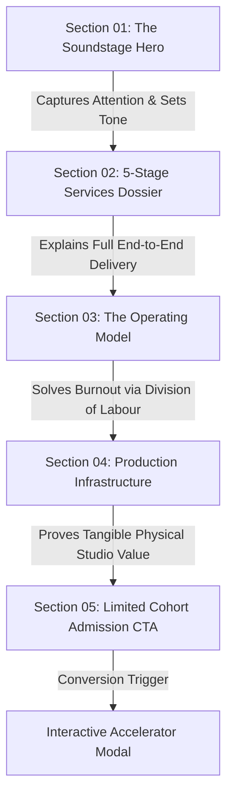

# sBloom Creators Studio Landing Page — Project Overview & Strategic Documentation

> **Target Audience for this Document:** Academic/Industry Mentors, Project Reviewers, and Stakeholders  
> **Project:** sBloom Creators Studio (`/creators`) — An Ottobon Professional Services Venture  
> **Repository Root:** `d:\Ottobon\sBloom new\S-Bloom`  
> **Component Root:** `src/components/creators/`  
> **Design Theme:** Warm Editorial Fine-Art Paper & Cinema Soundstage Studio  
> **Document Status:** Complete & Mentor-Ready  

---

## 1. Executive Summary & Core Purpose

The **sBloom Creators Studio landing page** is a high-conversion, editorial-grade web experience engineered specifically for individual creative talent: **artists, actors, musicians, performers, visual artists, and digital content creators**.

While the primary sBloom platform serves multiple commercial archetypes (including healthcare professionals, corporate executives, and educational institutions), the **Creators Landing Page** is a dedicated environment tailored to the psychological and creative needs of artistic individuals.

### The Big Problem It Solves:
Talented creators rarely fail due to a lack of artistic skill or ideas. They fail because of **technical friction and creative burnout**:
1. Trying to be a cameraman, lighting technician, sound engineer, video editor, and algorithm analyst simultaneously.
2. Feeling awkward, stiff, or unprepared when facing a camera alone at home.
3. Spending 80% of their energy on editing and troubleshooting software, leaving only 20% for actual creative expression.
4. Struggling to turn isolated viral moments into a sustainable, compounding digital brand.

---

## 2. What Message Does the Landing Page Convey?

The landing page delivers a clear, emotionally resonant, and empowering message across five foundational communication pillars:

```
                                  CORE MANTRA
              ┌──────────────────────────────────────────────────┐
              │   "Your Talent. Your Voice. Your Stage."         │
              │   "You Create. We Handle the Rest."              │
              └──────────────────────────────────────────────────┘
                                       │
        ┌──────────────────────────────┼──────────────────────────────┐
        ▼                              ▼                              ▼
 1. CREATIVE RELIEF             2. PHYSICAL REALITY            3. EDITORIAL DIGNITY
 Stop the multi-hat burnout.     Not just software or SaaS;     Treat creators as artists,
 Focus 100% on performance      a physical 4K acoustic         not commodity social media
 while we handle production.     soundstage with human guidance. content mills.
```

### Pillar 1: "You Create. We Handle the Rest." (Division of Labour)
The page relieves the creator's mental fatigue by clearly separating responsibilities:
- **The Artist's Role:** Bring raw talent, ideas, artistic vision, and genuine personality.
- **The Studio's Role:** Handle script frameworking, cinematic camera framing, studio lighting, studio acoustic capture, high-retention video editing, thumbnail design, and cross-platform scheduling.

### Pillar 2: "Your Talent Deserves a Soundstage, Not Just a Smartphone"
Modern social algorithms favor cinematic production quality and high retention. The page communicates that sBloom provides **real physical production infrastructure**—4K cinema cameras, professional studio lighting, acoustic isolation, and teleprompter assistance.

### Pillar 3: "Friendly Direction — Never Freeze on Camera"
A primary fear for creators is "camera freeze" or running out of things to say. The landing page conveys reassurance: you are not left alone in front of a lens. A dedicated in-studio director conducts comfortable Q&A prompts and guides body language.

### Pillar 4: "Bespoke Artistry, Zero Cheap Templates"
Content creators dread looking generic. The page explicitly promises **100% hand-crafted editing**—no automated cookie-cutter templates, retaining 100% intellectual property (IP) and creative rights for the artist.

### Pillar 5: "A Proven, Compounding 5-Stage Journey"
Building an audience is not treated as random luck; it is presented as an organized, systematic 5-stage accelerator: **Strategy &rarr; Production &rarr; Editing &rarr; Distribution &rarr; Growth**.

---

## 3. Structural & Section-by-Section Narrative Breakdown

The landing page is architected into **5 sequential story-driven sections**, each engineered to move the visitor from initial intrigue to trust, relief, and final conversion.



---

### Section 01 — The Director's Hero (`CreatorsHero.jsx`)
* **Primary Headline:**  
  *"Your Talent. Your Voice. Your Stage."*
* **Supporting Lead:**  
  *"Turn your talent and creative identity into a digital presence people remember. sBLOOM helps you turn your ideas into content, build your presence, reach your audience, and grow with the right creative tools and digital support."*
* **Visual Experience & Technical Hook:**
  - **Dual-Mode Cinema Soundstage Viewfinder:** Visitors can toggle between:
    1. `3D Studio Suite`: An interactive 4K video player showcasing sBloom's 3D motion capabilities, complete with sound toggles, play/pause controls, and live timecode scrubbing.
    2. `Live Soundstage`: Still frame photography of an Indian creator at a high-end soundstage microphone.
  - **Broadcast Telemetry Overlay:** Corner viewfinder brackets (`[ ]`), `REC • 4K DCI` live pulse dot, 24 FPS markers, and real-time audio pipeline labels (`CUT → STORY → AUDIO → COLOR → FINAL`).
* **Underlying Message Conveyed:**  
  *"You are entering a serious creative atelier. We don't just post videos; we broadcast your talent with cinematic authority."*

---

### Section 02 — The 5-Stage Creator Accelerator (`CreatorAccelerator.jsx`)
* **Section Tagline:** `WHAT WE DO` &bull; `ACTIVE COHORT`  
  *"Services for Creators and Artists. Everything you need to turn raw creative talent into a polished, high-performing digital presence—handled by our in-house team."*
* **One-Line Version Ribbon:**  
  `Strategy • Production • Editing • Distribution • Growth`
* **Architectural Layout:**
  - **Sticky Left Dossier:** Tracks the active stage index (`STAGE 01 OF 05`) with interactive buttons allowing instant jumping.
  - **Right Visual Cards & Spine Timeline:** As the visitor scrolls, an interactive scroll-spy algorithm calculates viewport distance and automatically focuses the corresponding card.
* **The 5 Concrete Services:**
  1. **Stage 01 — Content Strategy:** Ideas, creative direction, brainstorming high-impact video concepts, and mapping out a stress-free publishing calendar.
  2. **Stage 02 — Content Production:** Soundstage filming with 4K cinema cameras, flattering studio lights, and crystal-clear microphones. The creator just shows up.
  3. **Stage 03 — Editing & Post-Production:** Transforming raw takes into high-retention social videos with clean cuts, animated kinetic captions, custom soundscapes, and color grading.
  4. **Stage 04 — Content Distribution:** Repurposing one recording session into dozens of high-performing reels, shorts, and carousel formats across Instagram, YouTube, and LinkedIn.
  5. **Stage 05 — Creator Growth:** Hands-on workshops, personal brand development, brand collaboration opportunities, and audience equity building.
* **Underlying Message Conveyed:**  
  *"You do not need multiple disconnected agencies or freelancers. We provide an integrated, end-to-end publishing pipeline from initial idea to multi-platform audience growth."*

---

### Section 03 — The Operating Model (`CreatorDifference.jsx`)
* **Section Tagline:** `THE OPERATING MODEL` &bull; `Division of Labour`
* **Main Headline:**  
  *"You Create. We Handle the Rest."*  
  *Mantra: "LESS PRODUCTION STRESS. MORE TIME CREATING."*
* **The Studio Manifesto Plaque:**  
  > *"You bring the talent, ideas and personality. We handle the strategy, production, editing and distribution. Stop burning out trying to be a videographer, audio engineer, editor, and algorithm analyst all at once."*  
  > **THE ARTIST: Ideas & Vision + SBLOOM: Production Engine**
* **The 4-Station Connected Pipeline:**
  A dynamic horizontal pipeline featuring an illuminated kinetic beam connecting 4 clear checkpoints:
  - **Station 01 — Create (Owned by The Artist):** Focus on authentic voice, ideas, artistic vision, and personality.
  - **Station 02 — Produce (Owned by sBloom Studio):** 4K soundstage, acoustic isolation, teleprompter, and camera direction.
  - **Station 03 — Publish (Owned by sBloom Post-Desk):** Precision editing, retention pacing, thumbnail direction, and release schedules.
  - **Station 04 — Grow (Shared Milestone):** Compounding reach, algorithm alignment, and digital brand equity.
* **Underlying Message Conveyed:**  
  *"Your creative genius is your highest-leverage asset. Spending hours struggling with video timeline cuts is a waste of your gift. Delegate the heavy lifting to us."*

---

### Section 04 — Production Infrastructure (`CreatorInfrastructure.jsx`)
* **Section Tagline:** `THE sBLOOM STUDIO SYSTEM` &bull; `SECTION 04`
* **Main Headline:**  
  *"Production Infrastructure. Not Just an Editing Service."*
* **Core Philosophy:**  
  Many online services are simply remote freelancers who edit phone videos. sBloom differentiates itself through **physical, in-person production excellence**.
* **The 3 Atelier Cards (Featuring Dynamic Hover-Reveal Drawers):**
  1. **STUDIO 01 — The Studio Space:** Quiet acoustic environment, cinema lenses, professional key/fill/rim lighting, and teleprompter setup.
  2. **GUIDE 02 — Friendly Direction:** In-person coaching so creators never freeze, stutter, or feel self-conscious.
  3. **DESK 03 — Complete Video Editing:** Hand-crafted editing that removes pauses, balances audio levels, adds engaging text animations, and polishes color.
* **The sBloom Quality Promise Plaque:**  
  Guarantees: *✓ No Cheap Templates &bull; ✓ Studio-Quality Picture &bull; ✓ Engaging to Watch*
* **Underlying Message Conveyed:**  
  *"We are a real, tangible studio. You get the same tier of production and direction enjoyed by major broadcast talent."*

---

### Section 05 — Final Cohort Admission & CTA (`CreatorsCTA.jsx`)
* **Visual Accent:** Architectural diamond emblem divider (`◆`) and live status beacon.
* **Headline:**  
  *"Your Creativity Deserves an Audience."*
* **Exclusivity & Assurance:**
  - `LIMITED STUDIO COHORT` live pulsing badge.
  - 3 Core Pillars:
    - *Zero Generic Templates — 100% Bespoke*
    - *You Retain 100% of IP & Content Rights*
    - *Dedicated Production Desk & Editing Pipeline*
  - Fast response commitment: *Direct Studio Evaluation • Response Within 48 Hours*.
* **Visual Anchor:** High-resolution soundstage portrait framed within cinema viewfinder telemetry (`ACTIVE INTAKE // OTTOBON VERIFIED`).
* **Underlying Message Conveyed:**  
  *"Don't let your talent go unnoticed. Step up to a professional stage today with complete ownership and total peace of mind."*

---

## 4. Design Language & Visual Psychology

| Visual Element | Implementation in `creators.css` | Psychological Intent |
| :--- | :--- | :--- |
| **Color Palette** | Warm Archival Linen (`#F7F5F0`), Fine-Art Charcoal (`#0D0E10`), Studio Bronze/Coral (`#FF7043`) | Contrasts with the dark tech SaaS look; feels tactile, prestigious, and welcoming like an editorial art house. |
| **Film Grain** | Procedural 3.5% micro-grain overlay | Evokes cinematic film stock rather than cold, flat digital screens. |
| **Viewfinder HUD** | Corner brackets, REC dots, frame rate telemetry (`24 FPS`, `DCI 4K`) | Puts the creator mentally into the director’s chair and studio soundstage. |
| **Kinetic Motion** | Scroll-synced timeline, moving light beam pipeline, hover drawer reveal | Demonstrates polish, attention to detail, and modern interactivity without overwhelming the user. |
| **Typography** | Editorial Serif accents + crisp modern sans-serif | Balances artistic prestige with digital clarity. |

---

## 5. Summary of Key Talking Points for Your Mentor Presentation

When presenting this landing page to your mentor, use the following structured points to explain your product, design, and business reasoning:

1. **Strategic Segmentation:**  
   *"Rather than forcing creators into a generic corporate marketing funnel, we built a dedicated `/creators` experience that speaks directly to artistic identity, camera anxiety, and creative burnout."*

2. **The 'Division of Labour' Business Model:**  
   *"We designed Section 03 specifically to address the #1 reason creators quit: burnout. By clearly showing that the creator only handles ideas while sBloom manages production and post-desk, we eliminate barrier-to-entry friction."*

3. **Tangible Physical Differentiator:**  
   *"Unlike typical digital agencies that simply ask creators to film on their phones, our 'Production Infrastructure' section highlights our physical 4K soundstage, acoustic environment, and human director."*

4. **Scroll-Synced UX & Retention:**  
   *"In Section 02, we implemented an interactive scroll-synced dossier. As users scroll through the 5 services, the sticky dossier updates in real time, keeping navigation intuitive and visually engaging."*

5. **Risk Reversal & Trust:**  
   *"In Section 05, we explicitly address creator concerns regarding content ownership and quality by guaranteeing 100% IP retention, bespoke editing, and evaluation within 48 hours."*
