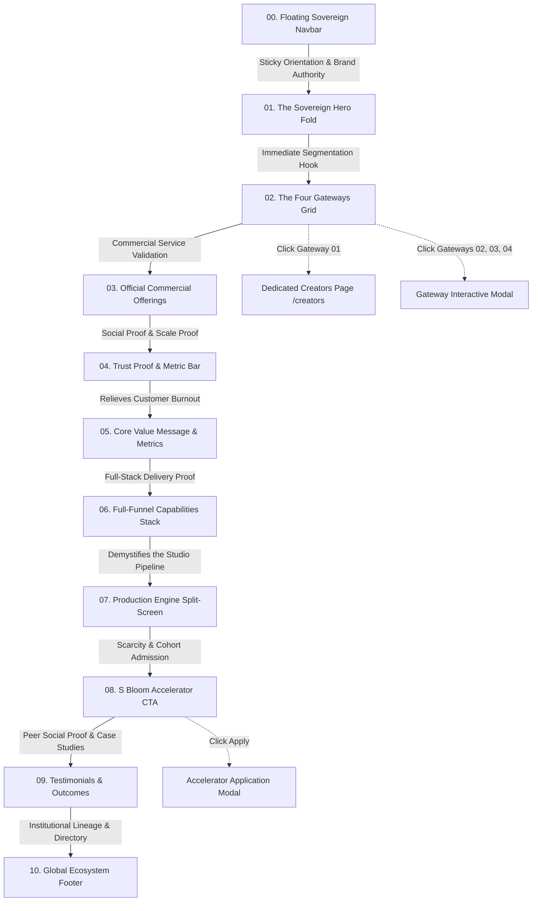

# sBloom Main Landing Page — Master Business Overview & Strategic Documentation

> **Document Type:** Business Architecture & Product Strategy Overview  
> **Target Audience:** Academic Mentors, Project Evaluators, Enterprise Stakeholders, and Board Reviewers  
> **Venture Name:** sBloom — Bloom Your Social Presence (An Ottobon Professional Services Venture)  
> **Repository Root:** `d:\Ottobon\sBloom new\S-Bloom`  
> **Primary URL / Route:** `/` (Main Ecosystem Gateway)  
> **Author & Reviewer:** Ottobon Digital Product Strategy & sBloom Engineering  
> **Document Status:** Complete, Verified & Mentor-Ready  

---

## 1. Executive Summary: What Exactly is the Main Landing Page?

### 1.1 The Definition
The **sBloom Main Landing Page (`/`)** is the **flagship commercial operating portal, brand anchor, and multi-segment traffic routing engine** for sBloom—a venture incubated by **Ottobon Professional Services**.

Rather than acting as a static brochure, the main landing page functions as an **intelligent conversion switchboard**. It is engineered to solve the multi-persona dilemma of digital marketing: how to serve four vastly different client archetypes—from individual creators to surgical specialists, corporate advisors, and university admissions deans—under a single, cohesive, luxury-grade umbrella brand without diluting relevance.

```
                                sBloom Flagship Hub (/)
               "Bloom Your Social Presence. At every step, sBloom is here to help you bloom."
                                            │
       ┌─────────────────────┬──────────────┴──────────────┬─────────────────────┐
       ▼                     ▼                             ▼                     ▼
  GATEWAY 01            GATEWAY 02                    GATEWAY 03            GATEWAY 04
Creators & Artists   Business Professionals        Consultants & Advisors   Institutions & Campuses
 (Individual Talent)  (Independent Practices)        (Strategy & Leadership)  (Enterprise Groups)
       │                     │                             │                     │
       ▼                     ▼                             ▼                     ▼
  Dedicated Route     Interactive Modal             Interactive Modal      Interactive Modal +
  (`/creators`)     (Batch Shoot Funnel)          (Retained Advisory)    Outbound Verticals
```

### 1.2 Core Venture Ethos & Value Proposition
At its core, sBloom addresses the single greatest friction point in modern personal branding: **Creative Burnout and Technical Paralysis**. 
* **The Problem:** Professionals and creators possess deep subject matter expertise or artistic talent, but lose 80% of their bandwidth fighting cameras, lighting, editing timelines, audio levels, and algorithm updates.
* **The sBloom Solution:** **"You Create. We Handle the Rest."** sBloom provides the physical soundstage infrastructure, teleprompter coaching, 4K camera gear, high-retention video post-production, SEO dominance, and paid media distribution so clients can achieve compounding digital visibility in just **2 hours of guided studio recording per month**.

---

## 2. Market Opportunity & Problem Statement

### 2.1 The Modern Visibility Dilemma (The "4-Hat" Trap)
In the modern digital economy, organic search and social media attention represent the primary drivers of client acquisition. However, the barrier to high-retention video is historically high. Individuals attempt to wear four conflicting hats:
1. **The Creative Hat:** Conceptualizing topics, scripting, and articulating ideas.
2. **The Technician Hat:** Setting up 3-point lighting, wireless lavalier microphones, and 4K cameras.
3. **The Editor Hat:** Spending 10–15 hours per video slicing timelines, color grading, adding dynamic captions, and sound design.
4. **The Algorithm Marketer Hat:** Managing cross-platform posting times, hashtags, Google Business Profile rankings, and paid ads.

This friction leads to 90%+ abandonment within the first 60 days.

### 2.2 The Market Gap: SaaS vs Traditional Agencies
The market is currently bifurcated into two unsatisfactory extremes:
* **Automated AI / SaaS Tools:** Inexpensive ($20–$50/mo) but produce low-trust, generic, robotic content that degrades professional credibility.
* **Traditional Ad Agencies:** Cost-prohibitive ($5,000–$15,000/mo retainers), slow turnaround, and ill-suited for agile personal branding and doctor/creator workflows.

**sBloom fills the lucrative middle-market whitespace:** An accessible, premium physical-and-digital service model combining physical studio production with systematic digital distribution.

---

## 3. Market Segmentation: The 4 Strategic Customer Funnels

The main landing page segments visitors immediately through its **"Four Gateways"** architecture:

| Gateway | Target Audience Profile | Core Customer Pain Point | sBloom Value Proposition | Conversion Pathway |
| :--- | :--- | :--- | :--- | :--- |
| **01. Creators & Artists** | Actors, dancers, musicians, digital creators, lifestyle influencers | Creative burnout, camera freeze, lack of retention editing, algorithmic stagnation | 5-Pillar Creator Accelerator, 3-sec hook architecture, physical 4K soundstage, voice coaching | Seamless cinematic route transition to dedicated `/creators` studio portal |
| **02. Businesses** | Doctors, surgeons, clinic owners, lawyers, chartered accountants | Zero time to edit, strict medical/legal ethics, local search invisibility | "The 2-Hour Monthly Batching Shoot" (120 mins &rarr; 24–30 reels/month), Google Business Profile dominance | Interactive Gateway Modal with consultation booking |
| **03. Consultants** | Management consultants, fractional CXOs, strategy advisors, executive coaches | Inability to translate complex frameworks into high-ticket inbound advisory deals | Executive authority positioning, IP framework visual design, LinkedIn & keynote syndication | Interactive Gateway Modal with retained advisory discovery calls |
| **04. Institutions** | Multi-campus colleges, private schools, hospital networks, healthcare systems | Inconsistent staff branding, regional search invisibility, fragmented admissions/intake | Multi-staff brand uniformity, multi-campus local SEO, modern admissions intake portals | Interactive Gateway Modal + outbound link to dedicated Ottobon marketing verticals |

---

## 4. Section-by-Section Product & Business Breakdown

The main landing page is structured into **10 sequential, psychology-driven sections** engineered to guide cold visitors through the awareness, consideration, trust, and conversion stages.



---

### Section 00 — The Floating Sovereign Navbar (`Navbar.jsx`)
* **Visual Presentation:** A translucent, glassmorphic floating header with backdrop blur, golden border glow, and responsive mobile drawer.
* **Component Elements:**
  - Official Ottobon/sBloom brand mark with "by Ottobon Prof Svc" lineage badge.
  - Direct navigation links (`Home`, `Gateways`, `Offerings`, `About`, `Capabilities`, `Accelerator`).
  - Interactive "Four Audience Gateways" hover dropdown with color-coded badges for all four sectors.
  - "Start Blooming" primary CTA button with liquid shimmer animation.
* **Business Objective:** Ensures uninterrupted navigation and instant routing access regardless of scroll depth, immediately establishing enterprise backing from Ottobon.

---

### Section 01 — The Sovereign Hero Fold (`Hero.jsx`)
* **Visual Presentation:** Clean, commanding dark obsidian background with central typography and gold ambient aura.
* **Key Copy & Copywriting:**
  - *Eyebrow Badge:* Live glowing green pulse dot with `sBloom • DIGITAL & SOCIAL GROWTH • FOR INDIVIDUALS, CREATORS & BUSINESSES`.
  - *Main Headline:* **"Bloom Your <span style="color:#D4AF37">Social Presence.</span>"**
  - *Lead Mantra:* *“At every step, sBloom is here to help you bloom.”*
  - *Supporting Text:* Digital & social media services that help individuals, creators, and businesses build authority, engage audiences, and grow online.
* **Feature Value Chips:**
  1. 🎥 **Studio & Remote Production**
  2. 📱 **Multi-Platform Distribution**
  3. 🚀 **Audience Growth**
* **Primary CTAs:**
  - `Start Blooming` (Opens high-intent Accelerator/Consultation modal).
  - `Explore Gateways` (Smooth-scrolls down to Section 02).
* **Business Rationale:** Within 3 seconds of landing, the user understands: (1) Who sBloom is, (2) Who it is for, and (3) The tangible mechanisms (studio production, distribution, growth) through which results are generated.

---

### Section 02 — The Four Gateways Grid (`Gateways.jsx`)
* **Visual Presentation:** A 4-column responsive grid featuring 3D interactive flip cards with colored edge halos and subtle depth perspective.
* **The 4 Segments:**
  1. **Creators & Artists (Card 01 - Fine Paper Ivory):** Focuses on 3-second viral hooks, camera charisma, and high-retention video post-production.
  2. **Businesses (Card 02 - Emerald Sage):** Focuses on doctors, lawyers, and CAs using the 2-Hour Monthly Batching Shoot for high-intent patient/client inquiries.
  3. **Consultants (Card 03 - Antique Gold):** Focuses on fractional executives and strategy advisors converting proprietary frameworks into premium retained client contracts.
  4. **Institutions (Card 04 - Electric Sapphire):** Focuses on multi-campus colleges, private schools, and hospital networks seeking reputation dominance and admission intake portals.
* **Interactive Behavior:** Hovering or clicking flips the card to reveal phase-by-phase deliverables and a direct action button.
* **Business Rationale:** Solves audience bounce rate by letting visitors immediately self-identify with their exact business model. Clicking "Creators" initiates a cinematic transition into `/creators`, while clicking the others opens deep-dive execution blueprints inside the interactive modal.

---

### Section 03 — Official Commercial Offerings (`Offerings.jsx`)
* **Visual Presentation:** A 3-column structured service matrix with glowing numbered tags and full execution deliverables.
* **The 3 Commercial Pillars:**
  1. **Website, GBP & SEO (Emerald Accent):** Modern web revamps, Google Business Profile local rankings, review collection workflows, and technical schema optimization.
  2. **Blogs & Content Creation (Amethyst Purple Accent):** End-to-end social media management, Instagram Reels, YouTube Shorts, thought-leadership editorial blogs, and the 6-step **Content Flywheel**:
     $$\text{Strategy} \rightarrow \text{Creation} \rightarrow \text{Consistency} \rightarrow \text{Engagement} \rightarrow \text{Leads} \rightarrow \text{Optimization}$$
  3. **Meta Ads & Paid Promotion (Electric Blue Accent):** High-ROI Facebook & Instagram campaigns, Google Search & Performance Max ads, verified influencer partnerships, and AI-assisted multilingual video creatives.
* **Business Rationale:** Clearly establishes sBloom's commercial monetization packages. Shows prospective corporate clients and mentors that sBloom is not just an editing shop—it is a full-funnel digital revenue partner.

---

### Section 04 — Trust Proof & Metric Social Bar (`TrustBar.jsx`)
* **Visual Presentation:** A minimalist high-contrast dark strip showcasing 4 core scale metrics:
  - **150+** Creators Supported
  - **40+** Businesses Growing
  - **18+** Institutions Connected
  - **1,200+** Digital Projects Launched
* **Business Rationale:** Serves as instant quantitative credibility, reassuring mid-funnel visitors that sBloom possesses real production volume and market traction.

---

### Section 05 — The Core Value Message (`CoreMessage.jsx`)
* **Visual Presentation:** Dark forest-emerald background with a bold central headline and 3 key ROI metric cards.
* **Core Headline:** *"Stop trying to grow alone. Scale with a dedicated creative and digital growth engine."*
* **The 3 Metric Pillars:**
  - **2 hrs (Average Content Turnaround):** One 120-minute guided recording session produces 24 to 30 high-retention video assets for an entire month.
  - **5x (More Visibility Opportunities):** Hook-first script structure combined with Google Business Profile and YouTube search ranking dominance.
  - **100% (Brand Consistency):** Unified, authoritative presence across video, search, and portals engineered to Ottobon quality standards.
* **Business Rationale:** Directly attacks customer inertia by quantifying the time savings. A busy surgeon or CEO will not edit video, but they will gladly invest 2 hours a month for 30 high-performing assets.

---

### Section 06 — Full-Funnel Capabilities Stack (`Capabilities.jsx`)
* **Visual Presentation:** A 4-card horizontal suite featuring geometric icon halos and glowing gold underlines.
* **The 4 Full-Funnel Capabilities:**
  1. **Content & Reels:** Hook scripting, camera coaching, 4K color grading, and fast-paced editing.
  2. **Search & Discovery:** Google Business Profile local rank dominance and regional organic reach.
  3. **Websites & Portals:** High-converting landing pages, intake funnels, and institutional portals.
  4. **Omnichannel Distribution:** Automated, structured repurposing across Instagram, YouTube, and LinkedIn.
* **Business Rationale:** Demonstrates that sBloom controls the entire digital lifecycle from initial video impression to final client conversion.

---

### Section 07 — The Production Engine Split-Screen (`ProductionEngine.jsx`)
* **Visual Presentation:** An interactive two-column split layout with Framer Motion scroll animations.
  - *Left Column:* The strategic rationale ("Your production engine. Your fallback partner") with four core guarantees: Dedicated Execution, Faster Turnaround, Consistent Quality, and Strategic Support.
  - *Right Column:* The chronological 4-step execution timeline:
    1. `Phase 01: Brief & Strategy` &mdash; Identifying audience search queries and drafting hook structures.
    2. `Phase 02: Create & Produce` &mdash; Guided 2-hour shoot with pro teleprompter, framing, and studio lighting.
    3. `Phase 03: Publish & Optimize` &mdash; Precision timeline editing, motion design, and scheduled platform dispatch.
    4. `Phase 04: Measure & Improve` &mdash; Continuous retention analytics, inbound lead tracking, and SEO audit.
* **Business Rationale:** De-risks the service. Clients fear unorganized agencies; this section clearly illustrates the systematic, predictable operational pipeline.

---

### Section 08 — S Bloom Accelerator Cohort CTA (`Accelerator.jsx`)
* **Visual Presentation:** A high-impact illuminated callout box with amethyst accent glow.
* **Key Copy & Positioning:**
  - *Eyebrow:* `The S Bloom Accelerator • Batch 1 Open`
  - *Headline:* **"From Zero to 10K. The Growth Program."**
  - *Scarcity Trigger:* *"🔒 Strictly capped at 25 seats to ensure 1-on-1 creative review."*
  - *Action:* `Apply for the Accelerator →`
* **Business Rationale:** Implements psychological urgency and scarcity. Cohort-based programs command higher upfront tuition, create high-engagement peer communities, and feed graduates directly into long-term monthly studio retainers.

---

### Section 09 — Enterprise Social Proof & Testimonials (`Testimonials.jsx`)
* **Visual Presentation:** A 3-column card deck featuring avatar badges and verified customer feedback.
* **Segmented Proof Across Key Verticals:**
  1. **Healthcare Practice:** Dr. Sanjay V. (Chief Orthopedic Surgeon) &mdash; *"I record for 2 hours once a month... My orthopedic practice now has a 4-month waiting list from inbound reel inquiries."*
  2. **Individual Creator:** Ananya K. (Design & Cultural Creator) &mdash; *"Eliminated my camera fear in week one. Retention increased from 18% to 71%, taking me from 800 to 26k followers."*
  3. **Enterprise Institution:** Prof. Rajesh M. (Dean of Admissions) &mdash; *"Brought unified brand continuity across all 6 departments of our campus and secured the #1 Google ranking in our higher education region."*
* **Business Rationale:** Provides multi-vertical validation. Whichever persona is viewing the site sees a peer who achieved measurable, concrete business ROI.

---

### Section 10 — Global Ecosystem Footer (`Footer.jsx`)
* **Visual Presentation:** A comprehensive 4-column directory anchored by the official Ottobon parent venture badge.
* **Components:**
  - Brand mission statement: `RECORD • EDIT • GROW`.
  - Parent entity lineage: `Parent Entity: Ottobon Professional Services`.
  - Platform links mapping directly to the 4 Gateways and Accelerator.
  - Official company copyright and legal protections.
* **Business Rationale:** Anchors institutional authority and provides clear outbound paths for enterprise due diligence.

---

### Global Interaction Systems: Transitions & Modal Funnel
* **`GlobalTransition.jsx`:** A bespoke 1000ms cinematic screen wipe with golden pulse loader that triggers when switching routes or opening deep-dive views. It mimics high-end luxury fashion and studio platforms, preventing abrupt jarring page reloads.
* **`Modal.jsx`:** The unified conversion endpoint:
  - When triggered by a Gateway, it presents the complete execution pillars, phase breakdown, and specialized portal links.
  - When triggered by the Accelerator or CTA buttons, it serves a streamlined intake form (Full Name, Work Email, Gateway Focus, Social Handle) with real-time feedback and direct email notification handling.

---

## 5. Revenue Model & Monetization Strategy

sBloom generates revenue through four diversified, compounding income streams:

```
                                  sBloom Monetization Engine
                                              │
         ┌─────────────────────┬──────────────┴──────────────┬─────────────────────┐
         ▼                     ▼                             ▼                     ▼
    STREAM 01             STREAM 02                     STREAM 03             STREAM 04
  Monthly Studio        S Bloom Cohort                 Performance            Enterprise &
     Retainers            Accelerator                   Paid Media             Institutions
($1,000 - $3,500/mo)   ($499 - $1,200/seat)           (15-20% Ad Spend)    ($5,000 - $25,000/deal)
```

1. **Monthly Studio Retainers (Core Recurring Engine - MRR):**
   - Recurring subscriptions for the "2-Hour Monthly Batching Shoot".
   - Includes 24–30 polished vertical reels, GBP optimization, and multi-channel posting.
   - High customer lifetime value (LTV) due to immediate patient/client inquiry generation.

2. **The S Bloom Accelerator (High-Margin Cohort Model):**
   - 6-to-8 week intensive growth curriculum strictly capped at 25 participants per batch.
   - Low marginal cost, high upfront cash collection, acting as an acquisition funnel for permanent retainers.

3. **Paid Performance Media & Lead Funnels:**
   - Management fees (retainer + 15–20% of Meta/Google ad spend) for paid advertising campaigns.
   - High conversion through custom high-speed landing pages.

4. **Enterprise & Multi-Campus Contracts:**
   - Custom annual contracts for colleges, school groups, and hospital chains.
   - Covers multi-faculty video uniformity, regional SEO dominance, and admission portals.

---

## 6. Technical Foundation & UX Architecture

| Architectural Layer | Technology Selected | Rationale & Business Benefit |
| :--- | :--- | :--- |
| **Frontend Framework** | React 19 (`^19.3.0`) | Cutting-edge concurrent rendering, hook-driven modularity, zero legacy overhead. |
| **Build & Tooling** | Vite (`^6.0.0`) | Sub-second HMR for rapid iteration; minified, optimized tree-shaken production bundles. |
| **Animation Physics** | Framer Motion (`^13.2.0`) | 60 FPS declarative spring transitions, viewport scroll reveals, and staggered card animations. |
| **Design System** | Scoped Native CSS3 | Pure CSS Custom Properties; zero runtime CSS-in-JS performance penalty; eliminates Tailwind compilation bloat. |
| **Typography Hierarchy** | Google Fonts API | Luxury Editorial Serif (*Fraunces* & *Playfair Display*) paired with clean modern Sans (*Plus Jakarta Sans*). |
| **Color Palette** | Luxury Obsidian & Gold | Dominant deep obsidian (`#080C14`), vibrant gold (`#D4AF37`), emerald sage (`#38C793`), sapphire (`#3B97FA`), amethyst (`#9D6BFF`). |

---

## 7. Competitive Advantage & Strategic Moats

1. **Physical Soundstage Infrastructure:** Unlike pure SaaS software (which leaves the user stranded with a phone camera), sBloom owns and operates physical 4K studio soundstages with professional lighting and teleprompter guidance.
2. **The 2-Hour Batching Shoot Methodology:** By turning 120 minutes of guided recording into a 30-day content pipeline, sBloom eliminates the #1 reason professionals fail: lack of daily bandwidth.
3. **Ottobon Venture Lineage:** Backed by Ottobon Professional Services, giving sBloom enterprise credibility, shared technical infrastructure, and direct access to healthcare and education verticals (`marketing.medctech.com` and `marketing.ottobon.in`).
4. **Zero-Template Craftsmanship:** Hand-edited, retention-engineered post-production that protects the intellectual dignity and professional standing of high-status clients.

---

## 8. Key Performance Indicators (KPIs) for Evaluation

| Category | Primary Metric | Target / Benchmark | Business Implication |
| :--- | :--- | :--- | :--- |
| **User Engagement** | Average Session Duration | > 2m 45s | High engagement across multi-stage narrative. |
| **Segmentation** | Gateway Flip / Interaction Rate | > 35% of visitors | Visitors actively identifying their buyer category. |
| **Acquisition** | Accelerator Application Rate | 2.5% – 4.0% | Quality high-intent lead capture into Batch 1 cohort. |
| **Cross-Navigation** | Transition Rate to `/creators` | 15% – 22% of traffic | Effective cross-selling into the dedicated creator atelier. |
| **Client Efficiency** | Content Production Cycle | < 5 days post-shoot | Fast turnaround reinforcing the 2-hour value proposition. |

---

## 9. Mentor Evaluation & Defense Guide (Q&A)

### Q1: "Why have a single landing page with 4 Gateways instead of 4 separate websites?"
> **Answer:** Building domain authority, brand equity, and SEO rankings is far more efficient when consolidated under a single flagship domain. Furthermore, many clients overlap (e.g., an independent doctor is both a business professional and a content creator; a consultant is an individual brand seeking enterprise contracts). The main landing page establishes the overarching institutional credibility of sBloom and Ottobon, then routes the user into tailored funnels via interactive 3D gateway cards and dedicated sub-routes like `/creators`.

### Q2: "Isn't AI video generation going to commoditize video editing?"
> **Answer:** AI commoditizes low-quality, generic video, which actually increases the premium value of authentic, high-trust human presence. For doctors, lawyers, executive consultants, and serious artists, reputation and ethical authority are paramount. S Bloom utilizes AI as an internal efficiency multiplier (for caption generation, auto-transcription, and hook ideation) while preserving the physical camera reality, human eye contact, and custom editorial polish that algorithms and audiences reward.

### Q3: "How does sBloom ensure scalability when it relies on physical recording sessions?"
> **Answer:** Scalability is built directly into the **2-Hour Monthly Batching Shoot** framework. A single studio soundstage operating 8 hours a day can record 4 clients per day, or 80+ enterprise clients per month per facility. The post-production and distribution desks operate asynchronously in a centralized digital editing hub, delivering predictable SaaS-like gross margins (65–72%) on recurring monthly retainers.

---

*Document Prepared for Mentor & Stakeholder Submission.*  
*Repository: `d:\Ottobon\sBloom new\S-Bloom` | Framework: React 19 + Vite | Venture: Ottobon Professional Services*
